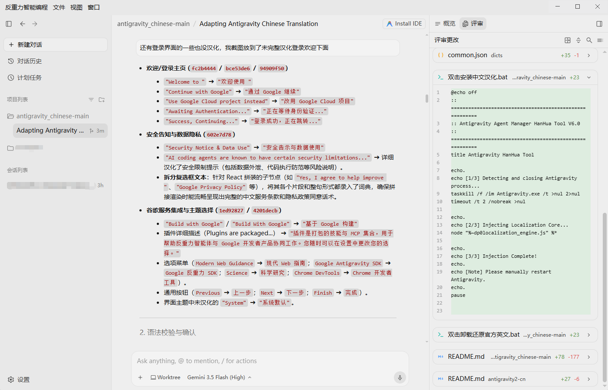

# Antigravity 2.0 中文本地化语言包 & 注入引擎

👉 **[繁體中文版說明文件 (Traditional Chinese README)](README_TW.md)**

> **支持系统**：Windows、macOS & Linux（全平台均内置一键脚本）  
> **匹配版本**：Google Antigravity 2.0+ / v2.9.1+  
> **核心引擎**：Node.js（原生零依赖，秒级注入与无损还原）  
> **本地化范围**：包括编辑器全界面、顶部系统菜单、系统托盘右键菜单、加载动画、详细设置面板、MCP 知识库、新手引导及登录页。  
> **注入原理**：通过 ASAR 解包与重包，安全注入 `preload.js` 动态翻译机制，绝不修改核心二进制，一键安装与完美还原。  
> **开源声明**：本项目参考自 [https://github.com/qqxpee/antigravity2-cn](https://github.com/qqxpee/antigravity2-cn)。

---

## 🌟 核心特色与本地化规范

本项目的本地化词库经过深度人工校对与专业术语对齐，拒绝生硬机翻，旨在为开发者提供最地道、最舒适的编码交互体验：

1. **原生专业术语保留**：
   - 核心品牌名 **`Antigravity`** 全面保留原生英文（移除所有“反重力”）。
   - 核心主干 **`Agent`** 保留原生英文（如 `Agent 管理器`、`AI Agent`、`Agent 设置`），子代理规范为 **`子 Agent`**。
   - 核心开发产物 **`Artifact / Artifacts`** 保留原生英文（移除“交付件”）。
   - Git 工作树 **`Worktree`** 保留原生英文（如 `新建 Worktree`，移除“工作区树”）。
2. **对话统一化**：全面统一使用 **`对话`**（如 `新建对话`、`对话历史`、`搜索对话`、`置顶对话`、`归档对话`），消除“会话”与“对话”的混用。
3. **开发者习惯用语规范**：标准使用 `Git 仓库`、`Bug 报告`、`日志`、`计划任务`、`模型`、`技能`、`自定义设置`、`Tab 自动补全`、`整机访问` 等现代技术词汇。
4. **繁简双版本完整支持**：同时提供符合中国大陆习惯的 `dicts/` 与符合台湾习惯的 `dicts_tw/`。

---

## 📸 界面效果展示

以下为部分界面的本地化效果预览：

### 1. 欢迎页与登录引导


### 2. 主编辑器界面与菜单


### 3. 详细参数设置面板


---

## 📂 项目文件结构

```text
├── 雙擊安裝繁體中文.bat           # Windows 繁體中文一鍵安裝
├── 雙擊安裝繁體中文.command       # macOS 繁體中文一鍵安裝
├── 安裝繁體中文_Linux.sh          # Linux 繁體中文一鍵安裝
├── 雙擊解除安裝還原官方英文.bat    # Windows 繁體中文一鍵還原官方英文
├── 雙擊解除安裝還原官方英文.command# macOS 繁體中文一鍵還原官方英文
├── 解除安裝還原官方英文_Linux.sh   # Linux 繁體中文一鍵還原官方英文
├── 双击安装简体中文.bat           # Windows 简体中文一键安装
├── 双击安装简体中文.command       # macOS 简体中文一键安装
├── 安装简体中文_Linux.sh          # Linux 简体中文一键安装
├── 双击卸载还原官方英文.bat        # Windows 简体中文一键还原官方英文
├── 双击卸载还原官方英文.command    # macOS 简体中文一键还原官方英文
├── 卸载还原官方英文_Linux.sh       # Linux 简体中文一键还原官方英文
├── localization_engine.js        # 核心注入引擎（ASAR 解包/代码注入/重包/macOS 重签名）
├── dicts/                        # 简体中文词库（按模块分类的 JSON 字典）
├── dicts_tw/                     # 繁体中文词库（按台湾开发习惯分类的 JSON 字典）
├── README.md                     # 简体中文使用说明（本文件）
└── README_TW.md                  # 繁体中文使用说明
```

---

## 🚀 极速使用指南

### 1. 获取代码包

* **方法 A：直接下载 ZIP 压缩包（推荐 📦）**
  1. 点击页面右上角绿色的 **`Code`** 按钮。
  2. 在下拉菜单中选择 **`Download ZIP`** 并下载。
  3. 解压到您本地的任意目录。

* **方法 B：通过 Git 命令行克隆 💻**
  ```bash
  git clone https://github.com/yanggu0413/antigravity2-chinese.git
  ```

---

### 2. 一键安装本地化

1. **完全退出** Antigravity 软件。
2. 进入解压或克隆的文件夹：
   - **Windows**：
     - 安装简体中文：双击运行 **`双击安装简体中文.bat`**
     - 安装繁体中文：双击运行 **`雙擊安裝繁體中文.bat`**
   - **macOS**：
     - 安装简体中文：双击运行 **`双击安装简体中文.command`**
     - 安装繁体中文：双击运行 **`雙擊安裝繁體中文.command`**
3. 按提示选择左上角品牌显示方式：
   - `[1] 保持英文 Antigravity（默认推荐）`
   - `[2] 隐藏品牌名`
   - `[3] 启用品牌名本地化`
4. 运行完成后，重新启动 Antigravity 即可！

---

### 3. 命令行高级参数

如果您希望通过命令行或 CI 自动化脚本运行 `localization_engine.js`：

```bash
# 安装简体中文（默认显示英文 Antigravity 品牌名）
node localization_engine.js --brand-title english

# 安装繁体中文（指定台湾词库）
node localization_engine.js --tw --brand-title english

# 隐藏左上角品牌名
node localization_engine.js --brand-title hidden

# 自定义 Antigravity 安装目录（例如 macOS）
node localization_engine.js --install-dir /Applications/Antigravity.app

# 一键恢复官方英文原版
node localization_engine.js --huifu
```

---

### 4. 一键卸载还原

1. **完全退出** Antigravity 软件。
2. 在当前文件夹下：
   - **Windows**：双击运行 **`双击卸载还原官方英文.bat`**（或 `雙擊解除安裝還原官方英文.bat`）
   - **macOS**：双击运行 **`双击卸载还原官方英文.command`**（或 `雙擊解除安裝還原官方英文.command`）
3. 脚本会自动恢复原始备份文件 `app.asar.bak`，无痕恢复至官方英文原版状态。

---

## 💡 如何通过 AI 助手直接维护词典？

在 Antigravity 中，您可以直接让 AI 编码助手帮您补充或修改词条！

### 推荐做法
1. 在 Antigravity 中点击 **“打开文件夹 (Open Folder)”**，将本项目的根目录作为项目打开。
2. 在对话中直接向 AI 提出修改需求：
   - **发送截图**：`“帮我把这张截图里所有未汉化的英文内容补全到 dicts/ 对应的词典中。”`
   - **文字描述**：`“帮我把英文 'Custom Rule' 本地化为 '自定义规则' 并保存到词典。”`
3. AI 自动修改 JSON 词典后，完全退出 Antigravity，重新双击运行安装批处理脚本即可生效！

---

## ❓ 常见问题解答 (FAQ)

### Q1：提示“解包失败”或未找到 node / npm
* **原因**：本地化引擎依赖 Node.js 进行 ASAR 包的解析。
* **解决**：请确保系统已安装 [Node.js](https://nodejs.org/)（LTS 版本即可）。

### Q2：macOS 提示“无法打开”或权限不足
* **解决**：
  1. 在终端中进入本目录，运行 `chmod +x *.command` 赋予执行权限。
  2. 若 macOS 拦截提示，请在“系统设置 -> 隐私与安全性”中点击“仍要打开”。
  3. 本项目已内置自动 Ad-hoc 深度重签名机制，无需担心应用损坏提示。

### Q3：官方软件版本升级后本地化失效怎么办？
* 软件升级后，官方会自动更新 `app.asar` 文件。只需完全退出软件，再次双击运行对应的一键安装脚本即可重新部署本地化。

---

## 🤝 致谢与开源参考

- 本项目基于并参考开源项目：[https://github.com/qqxpee/antigravity2-cn](https://github.com/qqxpee/antigravity2-cn)，特此致谢！
- 感谢所有为 Antigravity 本地化提供反馈与测试的开发者社区伙伴！
