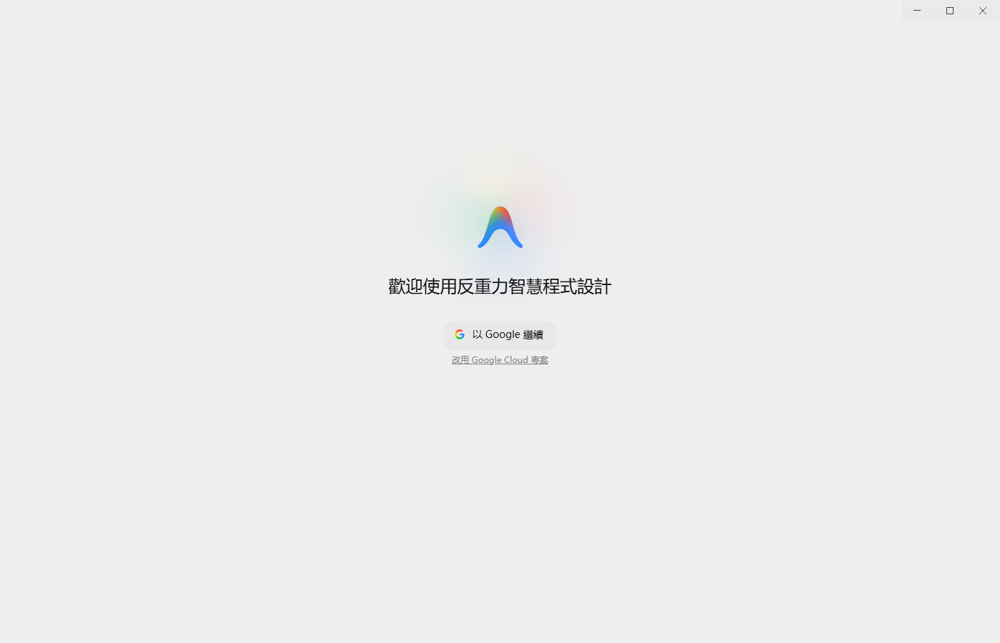
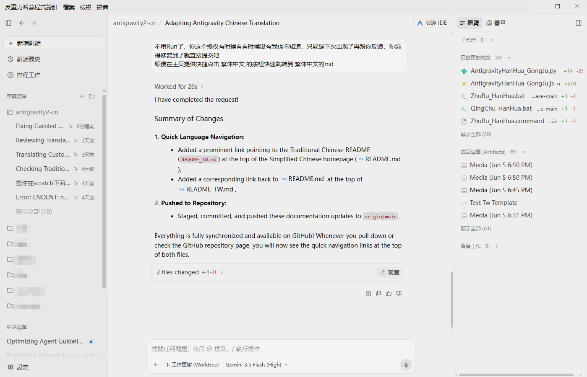
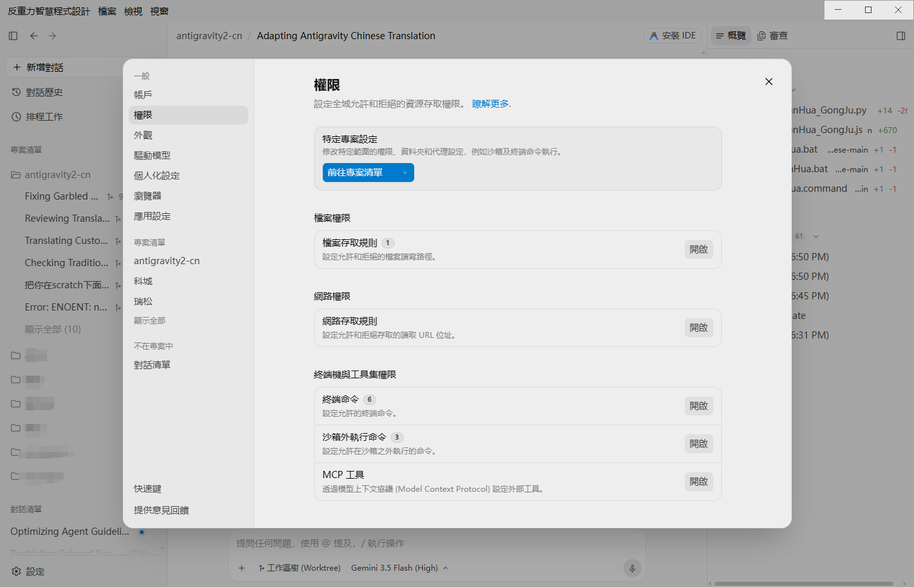

# Antigravity 2.0 繁體中文在地化語言包 & 注入引擎

👉 **[簡體中文版說明文件 (Simplified Chinese README)](README.md)**

> **支援系統**：Windows、macOS & Linux（全平台均內建一鍵執行指令檔）  
> **相容版本**：Google Antigravity 2.0+ / v2.9.1+  
> **核心引擎**：Node.js（原生零依賴，秒級注入與無損還原）  
> **在地化範圍**：包含編輯器全介面、頂部系統選單、系統匣右鍵選單、載入動畫、詳細設定面板、MCP 知識庫、新手引導及登入頁。  
> **注入原理**：透過 ASAR 解包與重包，安全注入 `preload.js` 動態翻譯機制，絕不修改核心二進位檔案，一鍵安裝與完美還原。  
> **開源聲明**：本專案參考至 [https://github.com/qqxpee/antigravity2-cn](https://github.com/qqxpee/antigravity2-cn)。

---

## 🌟 核心特色與在地化規範

本專案的繁體中文詞庫經過深度人工校對與台灣 IT 開發者慣用語對齊，拒絕生硬機翻與簡繁轉換字病，為開發者提供最舒適自然的編程體驗：

1. **原生專業術語保留**：
   - 核心品牌名 **`Antigravity`** 全面保留原生英文（移除所有「反重力 / 反重力智慧程式設計」）。
   - 核心主體 **`Agent`** 保留原生英文（如 `Agent 管理器`、`AI Agent`、`Agent 設定`），子代理規範為 **`子 Agent`**。
   - 核心開發產物 **`Artifact / Artifacts`** 保留原生英文（移除「交付件」）。
   - Git 工作樹 **`Worktree`** 保留原生英文（如 `新增 Worktree`，移除「工作區樹」）。
2. **對話統一化**：全面統一使用 **`對話`**（如 `新增對話`、`對話歷史`、`搜尋對話`、`置頂對話`、`封存對話`），消除「會話」與「對話」的混用。
3. **台灣開發者習慣用語規範**：標準使用 `Git 儲存庫`、`Bug 回報`、`Log 記錄 / 伺服器 Log 記錄`、`排程任務`、`解除安裝`、`快速鍵`、`模型`、`技能`、`自訂設定`、`Tab 自動完成`、`整部電腦存取`、`行銷`、`警報規則` 等地道詞彙。
4. **繁簡雙版本完整支援**：同時提供符合台灣習慣的 `dicts_tw/` 與符合中國大陸習慣的 `dicts/`。

---

## 📸 介面效果展示

以下為部分介面的在地化效果預覽：

### 1. 歡迎頁與登入引導


### 2. 主編輯器介面與選單


### 3. 詳細參數設定面板


---

## 📂 專案檔案結構

```text
├── 雙擊安裝繁體中文.bat           # Windows 繁體中文一鍵安裝
├── 雙擊安裝繁體中文.command       # macOS 繁體中文一鍵安裝
├── 安裝繁體中文_Linux.sh          # Linux 繁體中文一鍵安裝
├── 雙擊解除安裝還原官方英文.bat    # Windows 繁體中文一鍵還原官方英文
├── 雙擊解除安裝還原官方英文.command# macOS 繁體中文一鍵還原官方英文
├── 解除安裝還原官方英文_Linux.sh   # Linux 繁體中文一鍵還原官方英文
├── 双击安装简体中文.bat           # Windows 简体中文一键安装
├── 双击安装简体中文.command       # macOS 简体中文一键安装
├── 安装简体中文_Linux.sh          # Linux 简体中文一键安装
├── 双击卸载还原官方英文.bat        # Windows 简体中文一键还原官方英文
├── 双击卸载还原官方英文.command    # macOS 简体中文一键还原官方英文
├── 卸载还原官方英文_Linux.sh       # Linux 简体中文一键还原官方英文
├── localization_engine.js        # 核心注入引擎（ASAR 解包/程式碼注入/重包/macOS 重簽名）
├── dicts_tw/                     # 繁體中文詞庫（依台灣開發習慣分類的 JSON 字典）
├── dicts/                        # 簡體中文詞庫（依大陸開發習慣分類的 JSON 字典）
├── README_TW.md                  # 繁體中文使用說明（本文件）
└── README.md                     # 簡體中文使用說明
```

---

## 🚀 極速使用指南

### 1. 取得程式碼包

* **方法 A：直接下載 ZIP 壓縮包（推薦 📦）**
  1. 點擊頁面右上角綠色的 **`Code`** 按鈕。
  2. 在下拉選單中選擇 **`Download ZIP`** 並下載。
  3. 解壓縮到您電腦本機的任意資料夾。

* **方法 B：透過 Git 命令列複製 💻**
  ```bash
  git clone https://github.com/yanggu0413/antigravity2-chinese.git
  ```

---

### 2. 一鍵安裝在地化

1. **完全結束** Antigravity 軟體。
2. 進入解壓縮或複製的資料夾：
   - **Windows**：
     - 安裝繁體中文：按兩下執行 **`雙擊安裝繁體中文.bat`**
     - 安裝簡體中文：按兩下執行 **`双击安装简体中文.bat`**
   - **macOS**：
     - 安裝繁體中文：按兩下執行 **`雙擊安裝繁體中文.command`**
     - 安裝簡體中文：按兩下執行 **`双击安装简体中文.command`**
3. 依提示選擇左上角品牌顯示方式：
   - `[1] 保持英文 Antigravity（預設推薦）`
   - `[2] 不顯示品牌名稱`
   - `[3] 顯示繁體中文品牌名`
4. 執行完成後，重新啟動 Antigravity 即可暢享繁體中文介面！

---

### 3. 命令列進階參數

如果您希望透過命令列或 CI 自動化腳本執行 `localization_engine.js`：

```bash
# 安裝繁體中文（指定台灣詞庫，預設保留英文 Antigravity 品牌名）
node localization_engine.js --tw --brand-title english

# 安裝簡體中文
node localization_engine.js --brand-title english

# 隱藏左上角品牌名
node localization_engine.js --tw --brand-title hidden

# 自訂 Antigravity 安裝路徑（例如 macOS）
node localization_engine.js --tw --install-dir /Applications/Antigravity.app

# 一鍵還原官方英文原版
node localization_engine.js --huifu
```

---

### 4. 一鍵解除安裝還原

1. **完全結束** Antigravity 軟體。
2. 在當前資料夾下：
   - **Windows**：按兩下執行 **`雙擊解除安裝還原官方英文.bat`**（或 `双击卸载还原官方英文.bat`）
   - **macOS**：按兩下執行 **`雙擊解除安裝還原官方英文.command`**（或 `双击卸载还原官方英文.command`）
3. 腳本會自動還原原始備份檔案 `app.asar.bak`，無痕恢復至官方英文原版狀態。

---

## 💡 如何透過 AI 助手直接維護詞典？

在 Antigravity 中，您可以直接讓 AI 編程助手幫您補充或修改詞條！

### 推薦做法
1. 在 Antigravity 中點擊 **“開啟資料夾 (Open Folder)”**，將本專案的根目錄作為專案開啟。
2. 在對話中直接向 AI 提出修改需求：
   - **發送截圖**：`“幫我把這張截圖裡所有未翻譯的英文內容補全到 dicts_tw/ 對應的詞典中。”`
   - **文字描述**：`“幫我把英文 'Custom Rule' 翻譯為 '自訂規則' 並儲存到繁體字典。”`
3. AI 自動修改 JSON 詞典後，完全結束 Antigravity，重新執行安裝批次檔即可生效！

---

## ❓ 常見問題解答 (FAQ)

### Q1：提示「解包失敗」或找不到 node / npm
* **原因**：在地化引擎依賴 Node.js 進行 ASAR 包的解析。
* **解決**：請確認系統已安裝 [Node.js](https://nodejs.org/)（LTS 版本即可）。

### Q2：macOS 提示「無法打開」或權限不足
* **解決**：
  1. 在終端機中進入本目錄，執行 `chmod +x *.command` 賦予執行權限。
  2. 若 macOS 攔截提示，請在「系統設定 -> 隱私權與安全性」中點擊「仍要開啟」。
  3. 本專案已內建自動 Ad-hoc 深度重新簽名機制，無需擔心應用程式損壞提示。

### Q3：官方軟體版本升級後在地化失效怎麼辦？
* 軟體升級後，官方會自動覆蓋 `app.asar` 檔案。只需完全結束軟體，再次按兩下執行對應的一鍵安裝指令檔即可重新部署在地化。

---

## 🤝 致謝與開源參考

- 本專案基於並參考開源專案：[https://github.com/qqxpee/antigravity2-cn](https://github.com/qqxpee/antigravity2-cn)，特此致謝！
- 感謝所有為 Antigravity 在地化提供回饋與測試的開發者社群夥伴！
